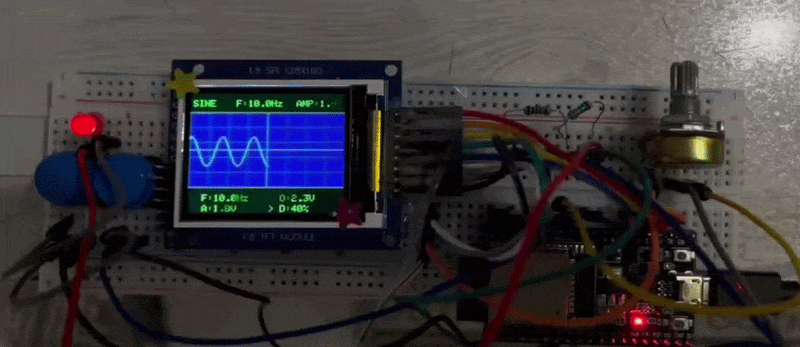
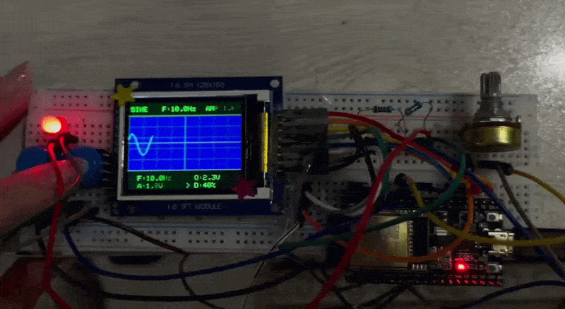
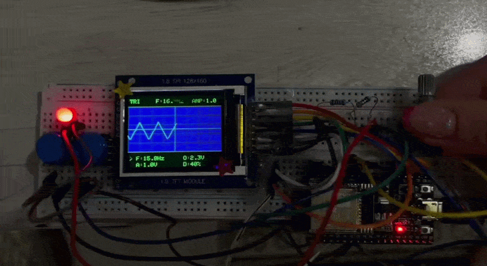
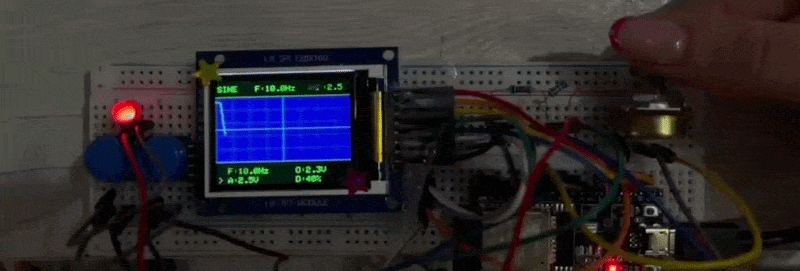
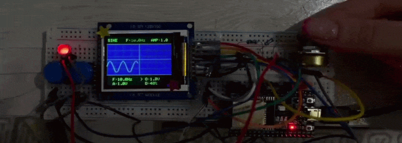
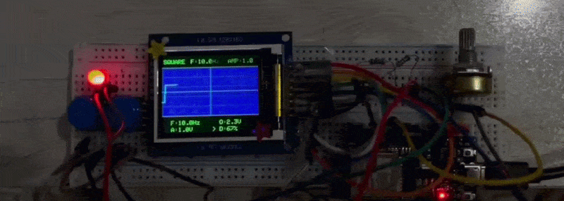

# 📟 PaniScope

<p align="center">
  
</p>

<p align="center">
  A Mini Digital Oscilloscope & Signal Generator with ESP32
</p>

PaniScope is a custom-built mini oscilloscope based on the ESP32 microcontroller.

The project was created from scratch to explore signal generation, analog-to-digital conversion, waveform processing, and embedded graphical rendering.

Instead of using an external oscilloscope module, this project uses the ESP32's internal DAC and ADC peripherals to generate and capture signals, then visualizes them on a TFT display in real time.


## ✨ Features

- Real-time waveform visualization
- Built-in signal generator
- Sine, square, triangle and pulse waveforms
- Adjustable frequency, amplitude, offset voltage and duty cycle
- Custom oscilloscope-style TFT interface
- ADC signal sampling
- DAC waveform generation
- 

## ❓ How It Works

PaniScope consists of three main stages:

Waveform Generation -> Analog Signal Capture -> Real-Time Visualization


### ⭐ 1. Signal Generation (ESP32 DAC)

The ESP32 contains an internal Digital-to-Analog Converter (DAC).


GPIO25 is used as an analog output: GPIO25 → DAC Output


The waveform is generated digitally using a lookup table.

For example, the sine wave is stored as 64 samples:

|  Sample   |  Degree |
| --------- | ------: |
| Sample 0  |  `0°`   |
| Sample 16 |  `90°`  |
| Sample 32 |  `180°` |
| Sample 48 |  `270°` |


During runtime, the samples are continuously sent to the DAC:

```cpp
dacWrite(signalOut, dacValue);
```

The generated digital values become a real analog voltage signal.


Supported waveforms:

* Sine wave
* Square wave
* Triangle wave
* Pulse wave


### ⭐ 2. Signal Sampling (ESP32 ADC)

The generated signal is connected to the ADC input.

ADC pin: GPIO32 → Analog Input

The ESP32 ADC converts the analog voltage into digital values: Analog Voltage -> ESP32 ADC -> Digital Samples (0-4095)

Each sample represents the voltage level at a specific moment. The ADC resolution is 12-bit:

|  Analog Voltage   |  Digital Samples  |
| ----------------- | ----------------- |
|        0V         |         0         |
|       3.3V        |        4095       |


### ⭐ 3.Waveform Rendering

After sampling, the ADC values are converted into screen coordinates. The conversion pipeline:

ADC Value -> Voltage Mapping -> Pixel Coordinate -> TFT Rendering

The waveform is drawn pixel by pixel using line interpolation:

```cpp
tft.drawLine();
```
This creates a smooth oscilloscope-like trace.


## 🎛️ User Controls

A potentiometer is used to modify parameters: GPIO33 → Potentiometer

Depending on the selected parameter, it controls:

* Frequency
* Amplitude
* Offset
* Duty cycle

Two buttons are used for navigation:

| Button | Function         |
| ------ | ---------------- |
| GPIO27 | Change waveform  |
| GPIO14 | Change parameter |


## 📺 Display

The user interface was designed from scratch using:

* Adafruit GFX
* Adafruit ST7735

The screen contains:

* Oscilloscope grid
* Center reference lines
* Live waveform
* Frequency and Amplitude display
* Parameter menu

The interface was inspired by classic laboratory oscilloscopes.


## 🛠️ Hardware

| Component        | Description             |
| ---------------- | ----------------------- |
| Microcontroller  | ESP32                   |
| Display          | 1.8" ST7735R TFT        |
| Signal Generator | ESP32 Internal DAC      |
| ADC Input        | ESP32 ADC               |
| Control          | Potentiometer + Buttons |

### ⭐ Signal System

| Function   | ESP32 Pin |
| ---------- | --------- |
| DAC Output | GPIO25    |
| ADC Input  | GPIO32    |


## 📼 Demo

### Waveforms

<p align="center">
  
</p>

### Frequency Settings

<p align="center">
  
</p>

### Amplitude Settings

<p align="center">
  
</p>

### Offset Settings

<p align="center">
  
</p>

### Dutycycle Settings

<p align="center">
  
</p>

⚠️ Note: DutyCycle only applies to Square and Pulse waveforms!


## ✨ Author & License

**Parnian Ghorbani**

This project is open-source and available for learning and educational purposes however; If you use this project or its ideas in your own work, please consider mentioning this repository and giving it a star. :)
